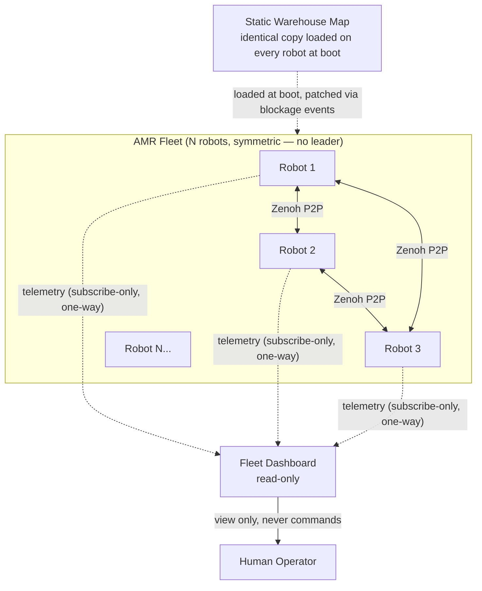
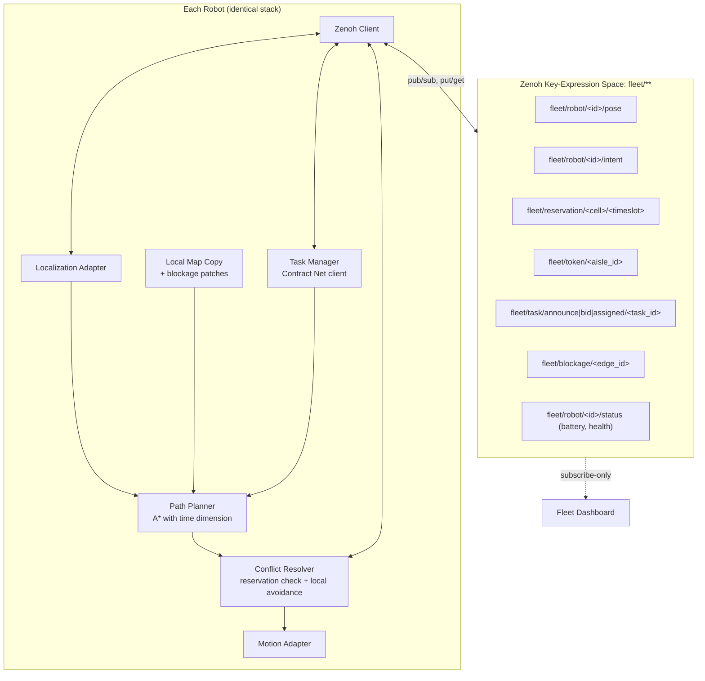

# Decentralized AMR Fleet — System Design Knowledge Base

> **Purpose of this document**: This is the authoritative design reference for the AMR (Autonomous Mobile Robot) fleet coordination project. It is written so that any AI assistant or engineer picking up this project later has a single, unambiguous source of truth — no invented details, no contradicting an earlier decision. If something is undecided, it is explicitly marked as **OPEN** in Section 11 rather than silently assumed. Anyone continuing this work should treat every non-OPEN item below as a fixed constraint, not a suggestion to re-derive.

---

## 1. Problem Statement (as given)

Modern smart warehouses rely on fleets of AMRs. Relying entirely on a centralized cloud server for path planning causes high network latency, WiFi dead-zone vulnerabilities, and single-point-of-failure risk. The task is to design a **decentralized coordination and collision-avoidance framework** for a multi-robot fleet (3+ AMRs) in a dynamic warehouse, running locally on edge hardware (Raspberry Pi / Jetson Nano class), handling:

1. Decentralized communication (no central server)
2. Dynamic multi-agent conflict resolution (deadlocks, collisions at choke points)
3. Task allocation & re-routing (reassign/re-plan if an aisle is blocked)

**Success criteria**: zero inter-robot collisions, and ≥20% reduction in total task completion time vs. a traditional centralized stop-and-wait baseline.

**Hardware note**: this project is **software-side only** — the physical robots/hardware are a given constraint (older, Pi/Jetson-class), not something being designed. All work here is the software stack that would run on that hardware.

---

## 2. Requirements Breakdown

| Requirement | What it means concretely |
|---|---|
| **Knowing where everyone is** | Every robot continuously knows the pose (position, heading) and intended near-future path of every other robot in range — without querying a server. |
| **Planning paths** | Every robot independently computes its own route from A→B on a shared map — no server computes it for them. |
| **Arbitrating conflicts** | When two robots' paths/timing overlap (intersection, choke point, aisle), the fleet resolves who goes first *without* asking a central authority — deterministically, so all robots reach the same conclusion independently. |
| **Read-only Fleet Dashboard** | A UI that shows live robot positions, battery, task status — it **only listens**, it never issues commands or makes decisions. Killing the dashboard must have zero effect on fleet operation. |
| **Zenoh workflow pattern** | The transport/coordination substrate is [Zenoh](https://zenoh.io) — a peer-to-peer pub/sub + query/queryable protocol, chosen over ROS2/DDS (too heavy for Pi-class hardware, O(n²) discovery chatter) and over raw UDP multicast (works, but you hand-roll discovery/filtering/distributed-state patterns that Zenoh gives for free). See Section 3 for the full comparison rationale already decided. |

**Non-negotiable architectural rule, repeated because it's the whole point of the project**: *there is no central decision-maker anywhere in the running system.* Every robot runs an identical software stack. The dashboard is a passive subscriber. Any design that reintroduces a server "just for the dashboard" or "just to break ties" violates the brief.

---

## 3. Why Zenoh (decision already made — do not re-litigate this)

| | ROS2 / DDS | Zenoh | Raw UDP multicast |
|---|---|---|---|
| Discovery cost | Heavy — O(n²) participant matching, chatty multicast | Light — "scouting" finds peers, then efficient unicast | Manual — you write your own heartbeat |
| Memory footprint per node | ~50–100MB+ | Few MB (Rust core) | Near-zero (your process only) |
| Distributed shared-state pattern | Not built in | Built in (pub/sub mirrors + Query/Queryable) | Hand-rolled from scratch |
| Fits Pi 3/4 comfortably | Marginal | Yes | Yes |
| Scales to microcontroller-class later | No | Yes (`zenoh-pico`) | N/A |

**Decision**: Zenoh is the transport and coordination substrate for the production system. Message-schema and algorithm logic should be validated first with a plain-UDP prototype (Phase 0, see Section 9) since the logic is transport-agnostic — but the target, real workflow is Zenoh end-to-end, which is what this document specifies.

---

## 4. System Diagrams

### 4.1 Level 0 — System Context



Key point for anyone implementing this: the arrow between Dashboard and Fleet is **one-directional**. There is no arrow from Human/Dashboard back into the Fleet's decision loop.

### 4.2 Level 1 — Per-Robot Component View + Zenoh Key Space



Every robot process contains **all** of these components. There is no separate "server process" anywhere in the deployment — even in simulation, each simulated robot is a full independent process running this entire stack.

---

## 5. Zenoh Key-Expression Schema (exact — implement as written)

| Key expression | Pattern | Payload | Producer | Consumer(s) |
|---|---|---|---|---|
| `fleet/robot/<id>/pose` | pub/sub, ~100–200ms | pose JSON (5.1) | that robot | all robots + dashboard |
| `fleet/robot/<id>/intent` | pub/sub, on replan | intent JSON (5.2) | that robot | all robots |
| `fleet/robot/<id>/status` | pub/sub, ~1s | status JSON (5.3) | that robot | dashboard (+ Contract Net bidders) |
| `fleet/reservation/<cell>/<timeslot>` | pub/sub (mirrored table) | reservation JSON (5.4) | claiming robot | all robots (each keeps a local mirror) |
| `fleet/token/<aisle_id>` | pub/sub, request+release | token JSON (5.5) | requesting/holding robot | robots wanting that aisle |
| `fleet/task/announce/<task_id>` | pub, once per task | task JSON (5.6) | task originator | idle/eligible robots |
| `fleet/task/bid/<task_id>/<robot_id>` | pub, within bid window | bid JSON (5.6) | bidding robot | all robots (each computes the same winner independently) |
| `fleet/task/assigned/<task_id>` | pub, once | assignment JSON | winning robot | all robots (confirms, others drop out) |
| `fleet/blockage/<edge_id>` | pub, with TTL | blockage JSON (5.7) | detecting robot | all robots (patch local map) |

Naming rule: `<id>`, `<cell>`, `<aisle_id>`, `<edge_id>`, `<task_id>` are all stable string identifiers defined once in the shared static map file — never invented ad hoc by a robot at runtime.

## 5.1–5.7 Message Payload Schemas (JSON — exact field names, do not rename)

```jsonc
// 5.1 fleet/robot/<id>/pose
{ "robot_id": "R1", "ts": 1730000000123, "x": 12.4, "y": 5.1, "theta": 1.57, "v": 0.6 }

// 5.2 fleet/robot/<id>/intent
{ "robot_id": "R1", "ts": 1730000000123,
  "path": [ {"cell": "C14", "t_enter": 1730000000500, "t_exit": 1730000001000}, ... ] }

// 5.3 fleet/robot/<id>/status
{ "robot_id": "R1", "ts": 1730000000123, "battery_pct": 78, "state": "MOVING|IDLE|CHARGING|BLOCKED|ERROR" }

// 5.4 fleet/reservation/<cell>/<timeslot>
{ "cell": "C14", "timeslot": 1730000000500, "robot_id": "R1",
  "priority": [0, 3.2, "R1"], "ts": 1730000000123 }
  // priority tuple = [task_urgency, distance_to_goal, robot_id] — see Section 6.3 for tie-break rule

// 5.5 fleet/token/<aisle_id>
{ "aisle_id": "A3", "owner": "R2", "requested_ts": 1730000000000, "expires_ts": 1730000005000 }
  // owner: null means the token is free

// 5.6 fleet/task/{announce|bid}/<task_id>
{ "task_id": "T88", "location": "C40", "deadline_ts": 1730000010000,
  "robot_id": "R3", "bid_score": 4.7 }
  // bid_score = weighted function of distance + battery + current load; lower wins (Section 6.4)

// 5.7 fleet/blockage/<edge_id>
{ "edge_id": "E22", "reported_by": "R1", "ts": 1730000000123, "ttl_ms": 30000 }
```

---

## 6. Core Algorithms (exact protocol — implement as specified, no invented shortcuts)

### 6.1 Path Planning
Each robot runs **A\* with a time dimension** over its local copy of the static grid map. Nodes are `(cell, time_bucket)`. Edge cost = travel time. Blocked edges (from `fleet/blockage/**`) get cost = ∞ for the TTL duration of the blockage. Output of planning = the `intent` path (5.2), published immediately after every replan.

### 6.2 "Knowing where everyone is"
Every robot subscribes to `fleet/robot/*/pose` and `fleet/robot/*/intent` from all peers and maintains an in-memory table of neighbor state. This table is the **only** source of truth a robot uses about other robots — never a server query.

### 6.3 Conflict Resolution — two layers, both required

**Layer A — Reservation table (macro, prevents deadlock at intersections)**
1. After planning, a robot checks its local mirrored reservation table (built by subscribing to `fleet/reservation/**`) for the `(cell, timeslot)` pairs along its path.
2. If a conflicting claim exists (same cell, overlapping timeslot, different robot), compare **priority tuples**: `[task_urgency, distance_to_goal, robot_id]`, compared lexicographically ascending — **smallest tuple wins**. `robot_id` is the final tie-breaker, guaranteeing a strict total order (no livelock, no two robots can "tie" forever).
3. Loser does **not** just stop — it replans (A* re-run with that cell/timeslot excluded), which may mean a short wait or a detour. Winner proceeds and publishes its claim on `fleet/reservation/<cell>/<timeslot>`.
4. This is a **soft lock** — Zenoh's pub/sub mirror is eventually consistent, not a true distributed mutex. That is acceptable *only because Layer B below is the actual collision-safety guarantee.*

**Layer B — Local avoidance (micro, the actual zero-collision guarantee)**
Using neighbor pose+velocity from `fleet/robot/*/pose`, each robot runs a reciprocal collision-avoidance check (target: ORCA — Optimal Reciprocal Collision Avoidance; prototype may use a simplified priority-yield rule — see Section 9) before executing any motion command. **This layer must never be skipped, even if Layer A reservations look clean** — Layer A is about efficient traffic flow, Layer B is the non-negotiable safety net.

**Choke points / single-lane aisles — token protocol**
1. Aisle segments are pre-identified in the static map with an `aisle_id`.
2. To enter, a robot publishes a claim on `fleet/token/<aisle_id>`; if the key is currently free (`owner: null`) or expired, and no competing claim arrives within a short window, it becomes owner.
3. If two robots claim simultaneously, resolve with the same priority-tuple rule as 6.3 Layer A.
4. Owner releases the token (publishes `owner: null`) on exiting the segment, or it auto-expires at `expires_ts` as a fail-safe against a robot going silent mid-segment.

### 6.4 Task Allocation — Contract Net Protocol (fully decentralized, no auctioneer)
1. A task (new pickup, or a reassignment triggered by blockage) is announced on `fleet/task/announce/<task_id>`.
2. Every idle/eligible robot computes `bid_score = w1*distance + w2*(1/battery_pct) + w3*current_load` and publishes it to `fleet/task/bid/<task_id>/<robot_id>` within a fixed bid window (e.g. 500ms).
3. **Every robot independently** — not a central auctioneer — waits out the bid window, looks at all bids it received for that `task_id`, and picks the winner via the same deterministic rule: lowest `bid_score`, tie-break by `robot_id`. Because every robot runs the identical selection function on the same observed bid set, they converge on the same winner without needing to elect one.
4. The winner confirms by publishing `fleet/task/assigned/<task_id>`; all other bidders drop the task.

### 6.5 Blockage Detection & Re-routing
1. A robot detecting a blocked aisle (sensor in real system; scripted/random event in simulation) publishes `fleet/blockage/<edge_id>` with a TTL.
2. Every robot patches its local map (edge weight → ∞ for the TTL duration) and re-runs A* if its current path used that edge.
3. If the blocked robot's own task cannot reach an alternate route within an acceptable detour cost, it re-announces its task via the Contract Net flow (6.4) so a better-positioned robot can take over.

---

## 7. Fleet Dashboard (read-only, by design)

- **Stack**: Node.js/Express backend subscribing to the relevant `fleet/**` keys (via Zenoh's REST/HTTP bridge, the simplest integration path into a Node service without native bindings) → forwards over Socket.IO → React frontend.
- **Renders**: live grid/canvas view of robot positions and headings, battery bars, per-robot status, active token holders (highlight locked aisle segments), active task assignments.
- **Hard rule**: the dashboard backend must never publish to any `fleet/**` key that a robot reads for decision-making. It may only subscribe. This should be enforced structurally (the dashboard's Zenoh session should not even declare a publisher for those keys), not just as a coding convention.

---

## 8. Prototype / Demo Plan (SIH-style, demo-first)

**Goal**: a convincing live demo before any physical hardware is touched.

1. **Phase 0 — Software-only simulation.** Model the warehouse as a grid. Run 3–5 robots as independent OS processes (or containers) on a single laptop, each running the *entire* stack in Section 4.2, communicating over localhost. Validate message schema and algorithm logic here first using plain UDP multicast as a stand-in transport (faster to get running, zero install friction) — the algorithm/logic layer is written against the schemas in Section 5 regardless of transport, so swapping UDP → Zenoh later does not touch this logic.
2. **Phase 1** — Add the reservation-table protocol (6.3 Layer A) and the aisle token protocol.
3. **Phase 2** — Add local avoidance (6.3 Layer B). Prototype-grade simplification: instead of full ORCA math, use a **priority-yield rule** — the lower-priority robot (per the same tuple rule) decelerates/holds within a safety radius while the higher-priority robot proceeds at normal speed. This is enough to demonstrate smooth flow vs. hard stop-and-wait, and is a documented, intentional simplification (not a hidden shortcut) — full ORCA is the stated production upgrade path.
4. **Phase 3** — Add Contract Net task allocation (6.4) and blockage re-routing (6.5).
5. **Phase 4** — Swap transport from UDP to Zenoh (schemas unchanged).
6. **Phase 5** — Build the dashboard (Section 7) subscribing to the same feed.
7. **Phase 6** — Benchmark (Section 10) and produce the comparison numbers for the success criteria.

Demo script suggestion: show the grid with 3+ moving dots, deliberately trigger a blockage mid-run and show live re-routing + task reassignment, then show the same task set run under a toggled "baseline centralized stop-and-wait" mode side-by-side with a timer, to visually prove the ≥20% improvement.

---

## 9. Dummy → Real Hardware Migration Path

Define two clean seams so the coordination/planning/conflict layers (Sections 5–7) **never change** when moving from simulation to real Pi/Jetson hardware:

- **Localization Adapter** interface: `get_pose() -> (x, y, theta, v)`
  - *Simulated*: kinematic dead-reckoning inside the sim loop.
  - *Real*: wheel encoders + fixed fiducial markers (e.g. AprilTags) at known warehouse coordinates, or a lightweight SLAM if budget/hardware allows. **This choice is OPEN — see Section 11.**
- **Motion Adapter** interface: `set_velocity(v, omega)`
  - *Simulated*: updates the robot's position variable directly each tick.
  - *Real*: sends motor driver commands via GPIO/PWM.

Everything above these two adapters — planning, conflict resolution, task allocation, Zenoh comms — is identical code in simulation and on real hardware. Migration is "swap the adapter implementation," not "rewrite the coordination logic."

---

## 10. Success Metrics & Evaluation Methodology

- **Zero collisions**: define a robot footprint radius `r`. At every simulation tick, check pairwise Euclidean distance between all robots; any pair `< 2r` apart is logged as a collision event. Success = 0 collision events across the full benchmark run.
- **≥20% completion-time reduction**: run an identical, fixed task set (same seed, same number of pickup/delivery tasks) under two modes:
  1. **Baseline**: centralized stop-and-wait simulation (a toggleable mode — robots must fully halt and wait for a turn at any shared cell, no local avoidance, no reservation flow).
  2. **Full decentralized system** (this design).
  Compare total makespan (time from first task start to last task completion). Requirement: `decentralized_makespan ≤ 0.8 × baseline_makespan`.

---

## 11. Open Decisions (explicitly unresolved — do not assume an answer)

- **Real localization technology** (encoders+fiducial markers vs. lightweight SLAM) — not yet chosen; deferred to Section 9 seam so it doesn't block software progress.
- **Full ORCA implementation vs. staying with the simplified priority-yield rule** beyond the prototype — ORCA is the stated production target, but not yet implemented.
- **Zenoh integration method for the Node.js dashboard** — REST/HTTP bridge suggested as the lowest-friction path; a native Zenoh client binding for Node is an alternative if the bridge proves limiting.
- **Whether the reservation table uses pure pub/sub mirroring (as specified in Section 6.3) or Zenoh's Storage/Queryable feature for late-joining robots to fetch a snapshot** — pub/sub mirroring is the baseline spec above; Queryable-based snapshot fetch is a possible addition for robots that join mid-run, not yet designed.
- **Exact bid-window duration and bid-score weights (`w1, w2, w3`)** in Section 6.4 — placeholder values only, need tuning against the actual warehouse layout and fleet size used in the demo.

---

## 12. Glossary

- **Peer**: any robot process; all peers run identical software, no peer has elevated authority.
- **Soft lock**: a claim made via eventually-consistent pub/sub, not a guaranteed distributed mutex — safe here only because Layer B (local avoidance) is the real safety guarantee.
- **Makespan**: total time from the first task starting to the last task finishing, used as the completion-time metric.
- **Priority tuple**: `[task_urgency, distance_to_goal, robot_id]`, compared lexicographically to deterministically break every conflict without communication beyond publishing the tuple itself.
- **Adapter seam**: the Localization/Motion interface boundary that isolates simulation-specific or hardware-specific code from the shared coordination logic.